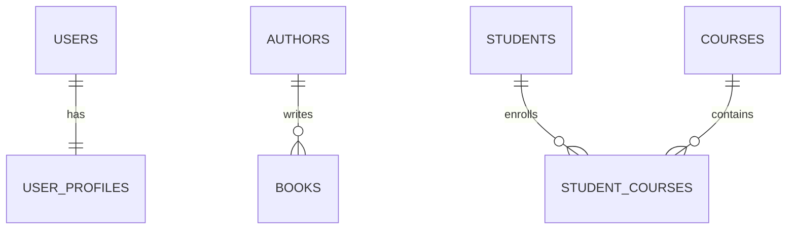

# Relationships trong Database

Relationship (Quan hệ) là cách các bảng liên kết với nhau thông qua **Foreign Key (FK)**. Thay vì lưu trùng lặp dữ liệu, ta chỉ lưu khóa tham chiếu để đảm bảo dữ liệu nhất quán và dễ quản lý.

---

# 1. Quan hệ 1-1 (One-to-One)

## Khái niệm

Quan hệ **1-1** nghĩa là:

- Một bản ghi của bảng A chỉ liên kết với **một** bản ghi của bảng B.
- Một bản ghi của bảng B cũng chỉ liên kết với **một** bản ghi của bảng A.

### Ví dụ thực tế

- User ↔ UserProfile
- User ↔ IdCard
- Employee ↔ Passport

Ví dụ:

Một User chỉ có một hồ sơ cá nhân.

Một UserProfile cũng chỉ thuộc về một User.

---

## Foreign Key nằm ở đâu?

FK **thường đặt ở bảng phụ** (`user_profiles`).

Ví dụ:

```text
users
-----
id (PK)
name

user_profiles
-------------
id (PK)
user_id (FK -> users.id) UNIQUE
phone
address
```

`user_id` là Foreign Key tham chiếu đến `users.id`.

Đồng thời đặt **UNIQUE** để đảm bảo một User chỉ có một Profile.

---

## Vì sao FK đặt ở bảng phụ?

Vì:

- User là dữ liệu chính.
- Profile là thông tin mở rộng.
- User có thể tồn tại trước, Profile có thể tạo sau.

Nếu đặt FK ở bảng `users` thì mỗi User sẽ phải chứa thêm cột `profile_id`, làm dữ liệu kém linh hoạt.

---

## ER Diagram

```text
users                 user_profiles
+---------+           +--------------+
| id (PK) |<--------->| user_id (FK) |
| name    |           | address      |
+---------+           | phone        |
                      +--------------+
```

---

# 2. Quan hệ 1-N (One-to-Many)

## Khái niệm

Quan hệ **1-N** nghĩa là:

- Một bản ghi phía "1" có thể liên kết với nhiều bản ghi phía "N".
- Một bản ghi phía "N" chỉ thuộc về một bản ghi phía "1".

---

## Ví dụ thực tế

Author ↔ Book

Một tác giả có thể viết nhiều sách.

Một cuốn sách chỉ có một tác giả.

---

Category ↔ Product

Một danh mục có nhiều sản phẩm.

Một sản phẩm chỉ thuộc một danh mục.

---

## Foreign Key nằm ở đâu?

FK **luôn đặt ở bảng N (bảng nhiều).**

Ví dụ:

```text
authors
-------
id (PK)
name

books
-----
id (PK)
title
author_id (FK -> authors.id)
```

---

## Vì sao?

Vì mỗi Book chỉ thuộc về **một Author**, nên chỉ cần lưu `author_id`.

Nếu đặt danh sách Book trong bảng Author sẽ rất khó quản lý và không đúng chuẩn thiết kế CSDL quan hệ.

---

## ER Diagram

```text
authors                  books
+---------+           +----------------------+
| id (PK) |<----------| author_id (FK)       |
| name    |           | id (PK)              |
+---------+           | title                |
                      +----------------------+
```

---

# 3. Quan hệ N-N (Many-to-Many)

## Khái niệm

Quan hệ **N-N** nghĩa là:

- Một bản ghi của bảng A liên kết với nhiều bản ghi của bảng B.
- Đồng thời một bản ghi của bảng B cũng liên kết với nhiều bản ghi của bảng A.

---

## Ví dụ thực tế

Student ↔ Course

Một sinh viên học nhiều môn.

Một môn học có nhiều sinh viên.

---

Book ↔ Category

Một cuốn sách có thể thuộc nhiều thể loại.

Một thể loại cũng chứa nhiều cuốn sách.

---

## Vì sao không nối trực tiếp 2 bảng?

Không thể lưu:

```
Student
--------
course1
course2
course3
...
```

hoặc

```
Course
-------
student1
student2
student3
...
```

vì:

- Không biết sẽ có bao nhiêu ID.
- Dữ liệu bị lặp.
- Khó thêm/xóa.
- Vi phạm chuẩn hóa (Normalization).

Do đó **không thể biểu diễn quan hệ N-N chỉ bằng hai bảng**.

---

## Giải pháp: Pivot/Junction Table

Tạo một bảng trung gian.

Ví dụ:

```text
students
--------
id (PK)
name

courses
-------
id (PK)
title

student_courses
---------------
student_id (FK)
course_id (FK)
```

---

## Pivot/Junction Table chứa gì?

Thông thường gồm:

- 2 Foreign Key

```
student_id
course_id
```

Ngoài ra có hai cách khai báo khóa chính:

### Cách 1: Primary Key riêng

```text
id (PK)
student_id (FK)
course_id (FK)
```

### Cách 2: Composite Primary Key

```text
PRIMARY KEY (student_id, course_id)
```

Ngoài hai FK, bảng trung gian còn có thể lưu thêm thông tin của mối quan hệ.

Ví dụ:

```text
student_id
course_id
score
status
enrolled_at
```

---

## ER Diagram

```text
students             student_courses              courses
+---------+          +----------------+          +---------+
| id (PK) |<-------->| student_id FK  |<-------->| id (PK) |
| name    |          | course_id FK   |          | title   |
+---------+          +----------------+          +---------+
```

---

# Mermaid ER Diagram



---

# Tóm tắt

| Quan hệ | Ví dụ | FK nằm ở đâu? |
|----------|----------------------|----------------------------|
| 1-1 | User ↔ UserProfile | Bảng phụ (`user_profiles.user_id`) + UNIQUE |
| 1-N | Author ↔ Book | Bảng N (`books.author_id`) |
| N-N | Student ↔ Course | Bảng trung gian (`student_courses`) chứa 2 FK và dùng PK riêng hoặc Composite PK |